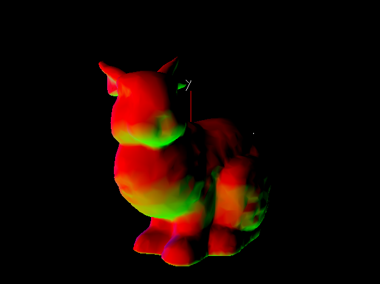
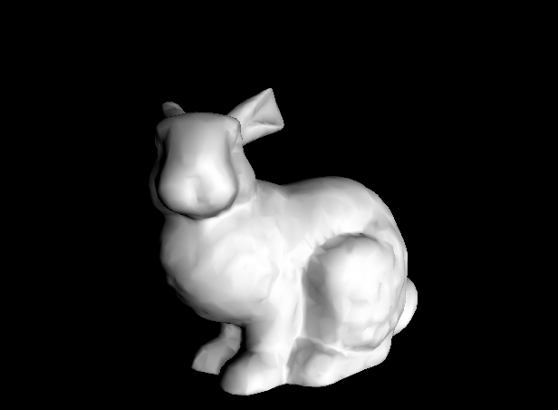
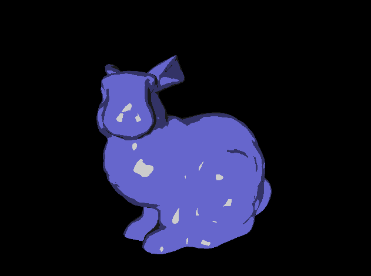

# TP 5
## Kris Touré

1. **Comment faire pour inverser le sens de la normale et obtenir cela? C’est-à-dire un lapin avec les couleurs inversées; bleu à l’arrière de la tête et vert devant.**

    Pour inverser les couleurs du lapin, nous devons <u>inverser</u> la valeur de la normale

    ```cpp
    color = vec4(-in_normal, 0.0);
    ```

    

2. **Question 2-8**
    Le code et l'image suivantes permettent de faire l'image qu'on a sur le tp. Pour le réaliser, nous devons modifier les fichiers suivants :
    - basic.vert.glsl
        ```cpp
        #version 150 core

        uniform mat4 model;
        uniform mat4 view;
        uniform mat4 proj;

        in vec3 in_pos;
        in vec3 in_normal;

        out vec3 lightDir;
        out vec3 eyeVec;
        out vec3 out_normal;

        void main(void)
        {
            vec4 vVertex = view * model * vec4(in_pos, 1.0);
            eyeVec = -vVertex.xyz;

            vec4 LightSource_position = vec4(0.0, 0.0, 10.0, 0.0);
            lightDir = vec3(LightSource_position.xyz - vVertex.xyz);

            out_normal = in_normal;

            gl_Position = proj * vVertex;
        }
        ```
    - basic.frag.glsl
        ```cpp
        #version 150 core

        in vec3 lightDir;
        in vec3 eyeVec;
        in vec3 out_normal;

        out vec4 frag_color;

        void main(void)
        {
            vec3 L = normalize(lightDir);
            vec3 N = normalize(out_normal);

            float intensity = max(dot(L, N), 0.0);
            frag_color = vec4(intensity, intensity, intensity, 1.0);
        }
        ```
    - td5.cpp (seulement la fonction display)
        ```cpp
        void display()
        {
            glClear(GL_COLOR_BUFFER_BIT | GL_DEPTH_BUFFER_BIT);

            view = glm::lookAt(glm::vec3(eye[0], eye[1], eye[2]), glm::vec3(eye[0], eye[1], eye[2] - 1.0), glm::vec3(0.0f, 1.0f, 0.0f));
            model = glm::mat4(1.0f);
            model = glm::translate(glm::mat4(1.0f), glm::vec3(-x, -y, -z)) * model;
            model = glm::scale(glm::mat4(1.0f), glm::vec3(scale * 3.5)) * model;
            model = glm::rotate(glm::mat4(1.0f), glm::degrees(angle), glm::vec3(0.0f, 1.0f, 0.0f)) * model;

            glUseProgram(progid);

            glUniformMatrix4fv(glGetUniformLocation(progid, "model"), 1, GL_FALSE, &model[0][0]);
            glUniformMatrix4fv(glGetUniformLocation(progid, "view"), 1, GL_FALSE, &view[0][0]);
            glUniformMatrix4fv(glGetUniformLocation(progid, "proj"), 1, GL_FALSE, &proj[0][0]);

            glBindVertexArray(vaoids[0]);
            glDrawElements(GL_TRIANGLES, nbtriangles * 3, GL_UNSIGNED_INT, 0);

            check_gl_error();
            glutSwapBuffers();
        }
        ```

    Résultat de ce code :

    

9. **Effet toonify**

    Pour faire cette effet, nous devons changer les deux shaders

    Fichier basic.vert.glsl

    ```cpp
    #version 150 core

    uniform mat4 model;
    uniform mat4 view;
    uniform mat4 proj;

    in vec3 in_pos;
    in vec3 in_normal;

    out vec3 lightDir;
    out vec3 eyeVec;
    out vec3 out_normal;

    void main(void)
    {
        mat4 modelview = view * model;
        vec4 vVertex = modelview * vec4(in_pos, 1.0);
        eyeVec = -vVertex.xyz;

        vec4 LightSource_position = vec4(0.0, 0.0, 10.0, 0.0);
        lightDir = vec3(LightSource_position.xyz - vVertex.xyz);

        out_normal = mat3(modelview) * in_normal;

        gl_Position = proj * vVertex;
    }
    ```

    Fichier basic.frag.glsl

    ```cpp
    #version 150 core

    in vec3 lightDir;
    in vec3 eyeVec;
    in vec3 out_normal;

    out vec4 frag_color;

    vec4 toonify(in float intensity) {
        vec4 color;
        if (intensity > 0.98)
            color = vec4(0.8, 0.8, 0.8, 1.0);
        else if (intensity > 0.5)
            color = vec4(0.4, 0.4, 0.8, 1.0);
        else if (intensity > 0.25)
            color = vec4(0.2, 0.2, 0.4, 1.0);
        else
            color = vec4(0.1, 0.1, 0.1, 1.0);
        return color;
    }

    void main(void)
    {
        vec3 L = normalize(lightDir);
        vec3 N = normalize(out_normal);

        float intensity = max(dot(L, N), 0.0);
        frag_color = toonify(intensity);
    }
    ```

    Résultat du code : 
    
    

10. **Effet Phong**
    ```cpp
    #version 150 core

    in vec3 lightDir;
    in vec3 eyeVec;
    in vec3 out_normal;

    out vec4 frag_color;

    void main(void)
    {
        vec3 L = normalize(lightDir);
        vec3 N = normalize(out_normal);

        float intensity = max(dot(L, N), 0.0);

        vec4 final_color = vec4(0.2, 0.2, 0.2, 1.0);
        final_color += 0.6 * intensity;

        frag_color = final_color;
    }
    ```

13. **Mélange des deux**
    ```cpp
    #version 150 core

    in vec3 lightDir;
    in vec3 eyeVec;
    in vec3 out_normal;

    out vec4 frag_color;

    void main(void)
    {
        vec3 L = normalize(lightDir);
        vec3 N = normalize(out_normal);
        vec3 E = normalize(eyeVec);
        vec3 R = reflect(-L, N);

        float intensity = max(dot(L, N), 0.0);
        float specular = pow(max(dot(R, E), 0.0), 2.0);

        vec4 final_color = vec4(0.2, 0.2, 0.2, 1.0);
        final_color += 0.6 * intensity;
        final_color += vec4(0.8, 0.8, 0.8, 1.0) * specular;

        frag_color = final_color;
    }
    ```

15. **Tole moins poli**
    ```cpp
    #version 150 core

    uniform mat4 model;
    uniform mat4 view;
    uniform mat4 proj;

    in vec3 in_pos;
    in vec3 in_normal;

    out vec3 lightDir;
    out vec3 eyeVec;
    out vec3 out_normal;

    float random(vec2 st) {
        return fract(sin(dot(st.xy, vec2(12.9898, 78.233))) * 43758.5453123);
    }

    void main(void)
    {
        mat4 modelview = view * model;
        vec4 vVertex = modelview * vec4(in_pos, 1.0);
        eyeVec = -vVertex.xyz;

        vec4 LightSource_position = vec4(0.0, 0.0, 10.0, 0.0);
        lightDir = vec3(LightSource_position.xyz - vVertex.xyz);

        out_normal = vec3(
            modelview * vec4(
                in_normal.x + 0.5 * random(in_pos.xy),
                in_normal.y + 0.5 * random(in_pos.xz),
                in_normal.z + 0.5 * random(in_pos.yz),
                0.0
            )
        );

        gl_Position = proj * vVertex;
    }
    ```